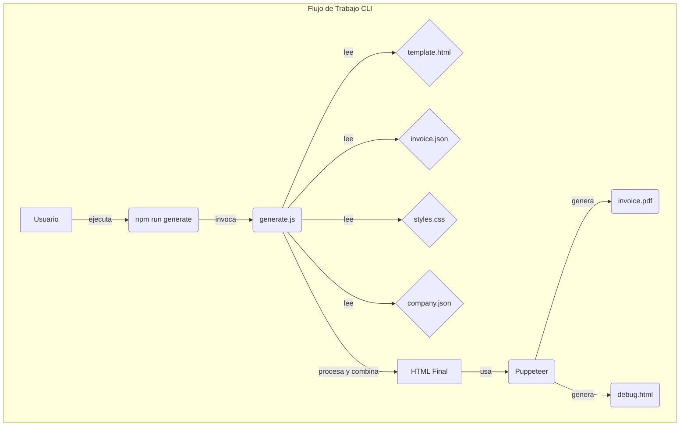
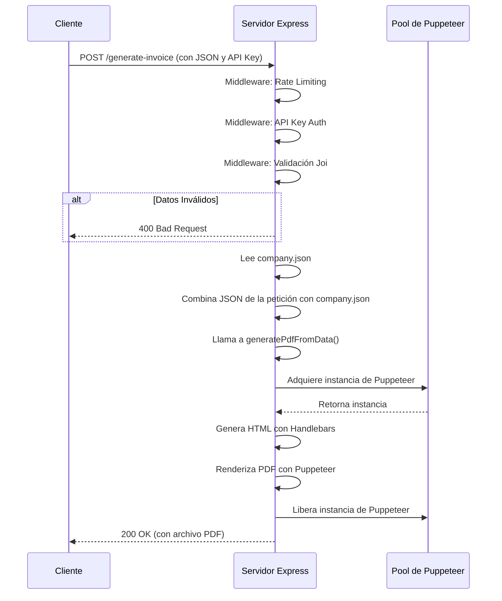

# Generador de Facturas en PDF con Node.js

Este proyecto ofrece una solución robusta y profesional para generar documentos PDF (facturas, cotizaciones, etc.) a partir de datos en formato JSON. Utiliza Node.js, Handlebars para plantillas HTML, CSS para un diseño personalizable y Puppeteer para la conversión a PDF.

Incluye un script para uso por línea de comandos (CLI) y un servidor con una API REST lista para integrarse con sistemas externos como n8n, Zapier, o cualquier aplicación backend.

---

## Diagramas de Flujo

### Flujo de Trabajo (CLI)



### Flujo de Trabajo (API)



---

## Características Principales

- **Generación Dual**: Funciona tanto por CLI como a través de una API REST.
- **Plantillas Dinámicas**: Usa Handlebars para inyectar datos en una plantilla HTML.
- **Diseño Personalizable**: Los estilos se controlan con un archivo CSS externo, facilitando la adaptación a cualquier identidad de marca.
- **Cálculos Automáticos**: Calcula subtotales, impuestos (IVA) y descuentos en el backend.
- **Incrustación de Recursos**: Las imágenes (logos) y fuentes personalizadas se incrustan en el PDF en formato Base64, garantizando portabilidad y eliminando dependencias externas.
- **Encabezado y Pie de Página**: Soporte para encabezados y pies de página que se repiten en cada hoja del PDF.
- **Modo de Depuración**: Genera un archivo `debug.html` para previsualizar y ajustar el diseño fácilmente en un navegador antes de generar el PDF.
- **API de Alto Rendimiento**: El servidor utiliza un pool de instancias de Puppeteer para manejar peticiones concurrentes de forma eficiente.
- **Logging Estructurado**: La API registra logs detallados con `pino` para un monitoreo y depuración sencillos.
- **Seguridad**: La API incluye autenticación por API Key y limitación de peticiones (rate limiting).
- **Validación de Datos**: Los datos de entrada de la API son validados usando Joi.

## Requisitos
- **Node.js**: `v18.0` o superior (requerido por Puppeteer).
- **Gestor de Paquetes**: `npm` o `pnpm`.

---

## Estructura del Proyecto

La estructura está organizada para separar la lógica, las plantillas, los datos y los archivos de salida.

```
invoice_html_project/
├── src/
│   ├── api/
│   │   └── server.js             # Servidor Express para la API REST
│   ├── assets/
│   │   ├── fonts/
│   │   │   └── DanhDa-Bold.ttf   # Fuentes personalizadas
│   │   ├── logo blanco png.png
│   │   ├── logo negro.png
│   │   └── logotipo negro.png
│   ├── data/
│   │   ├── company.json          # Datos globales de la empresa
│   │   └── invoice.json          # Ejemplo de datos de una factura
│   ├── templates/
│   │   ├── template.html         # Plantilla principal de la factura
│   │   └── styles.css            # Hoja de estilos principal
│   ├── utils/
│   │   ├── invoice_schema.js     # Esquema de validación de Joi
│   │   └── invoice_utils.js      # Lógica de negocio y cálculos
│   └── output/
│       ├── invoice.pdf           # PDF generado por defecto
│       └── debug.html            # Archivo HTML para depuración
├── generate.js                   # Script principal para la generación CLI
├── tests/
│   └── generate-invoice.test.js  # Pruebas para la generación de facturas
├── package.json
└── README.md
```

---

## Instalación

1. Clona el repositorio o descarga el código.
2. Instala las dependencias:

   Con `npm`:
   ```bash
   npm install
   ```
   O con `pnpm`:
   ```bash
   pnpm install
   ```

---

## Uso por Línea de Comandos (CLI)

El script `generate.js` permite crear un PDF directamente desde la terminal.

### Comando Básico

Para generar un PDF usando los archivos de configuración por defecto (`src/data/invoice.json`, `src/templates/template.html`, etc.):

```bash
npm run generate
```

El archivo `invoice.pdf` se generará en la carpeta `src/output/`.

### Opciones Avanzadas

Puedes especificar rutas personalizadas para los archivos de entrada y salida usando argumentos de línea de comandos:

```bash
node generate.js --template /ruta/a/mi/plantilla.html --data /ruta/a/mis/datos.json --output /ruta/de/salida/factura.pdf
```

---

## Uso como API REST

Inicia el servidor:

```bash
npm run api
```

El servidor se ejecutará en `http://localhost:3000`.

### Endpoint

- **POST** `/generate-invoice`
- **Body:** JSON de la factura (ver ejemplo en `src/data/invoice.json`).
- **Headers:**
    - `Content-Type`: `application/json`
    - `x-api-key`: `supersecretkey` (o el valor de la variable de entorno `API_KEY`)
- **Respuesta:** PDF (content-type: `application/pdf`)

#### Ejemplo de petición (curl):
```bash
curl -X POST http://localhost:3000/generate-invoice \
  -H "Content-Type: application/json" \
  -H "x-api-key: supersecretkey" \
  --data-binary @"src/data/invoice.json" \
  --output factura.pdf
```

---

## Personalización
- **Plantilla:** Modifica `src/templates/template.html` para cambiar la estructura visual.
- **Estilos:** Edita `src/templates/styles.css` para personalizar colores, fuentes y tamaños.
- **Logos:** Cambia los archivos en `src/assets/`.
- **Fuente:** Usa cualquier fuente TTF en `src/assets/fonts/` y actualiza la regla `@font-face` en el CSS.
- **Datos de la Empresa:** Modifica `src/data/company.json` para establecer los datos de tu empresa.

---

## Desarrollo y Depuración

Para facilitar el diseño de la plantilla, el script `generate.js` crea un archivo `debug.html` en la carpeta `src/output/`. Este archivo contiene el HTML renderizado antes de la conversión a PDF, permitiéndote previsualizar los cambios en un navegador.

---

## Rendimiento y Logging (API)

### Pool de Puppeteer

El servidor utiliza un pool de instancias de Puppeteer (mediante `generic-pool`) para manejar múltiples peticiones concurrentes de generación de PDF de forma eficiente. Esto evita cuellos de botella y mejora el rendimiento bajo alta demanda.

### Logging estructurado

Se utiliza `pino` para registrar logs estructurados de todas las peticiones, errores y eventos relevantes. Los logs se muestran en la consola y se pueden redirigir a un archivo para su posterior análisis.

---

## Solución de Problemas
- **Puppeteer no instala Chromium:**
  - Ejecuta `PUPPETEER_SKIP_CHROMIUM_DOWNLOAD=1 npm install puppeteer` y asegúrate de tener Chrome instalado.
- **El PDF no muestra imágenes o fuentes:**
  - Verifica que las rutas a los assets en el HTML y CSS sean correctas.
- **Error de permisos en puertos:**
  - Cambia el puerto en `src/api/server.js` si el puerto 3000 está ocupado.

---

## Créditos y Licencia
- Proyecto desarrollado utilizando Node.js, Handlebars, Puppeteer, Express, y otras librerías de código abierto.
- Licencia MIT.
